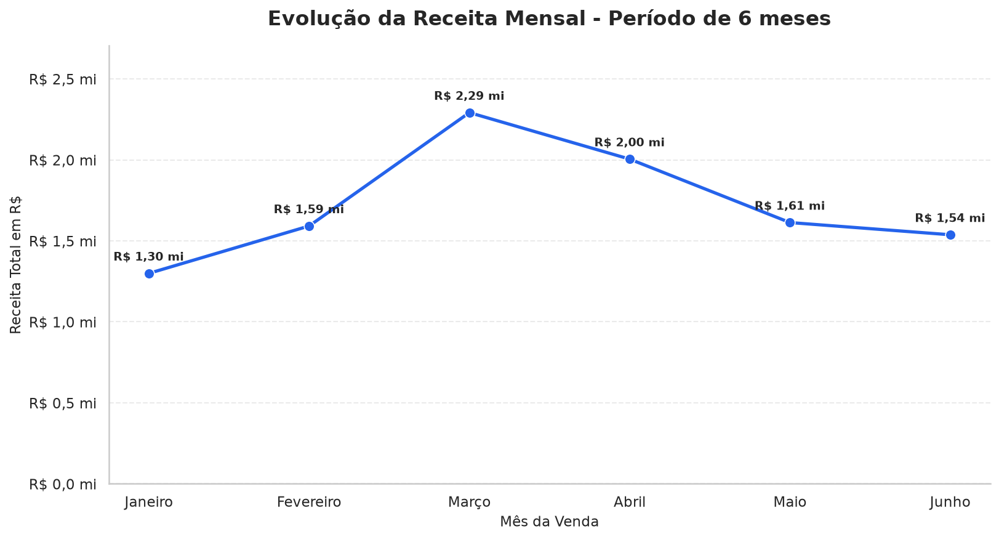
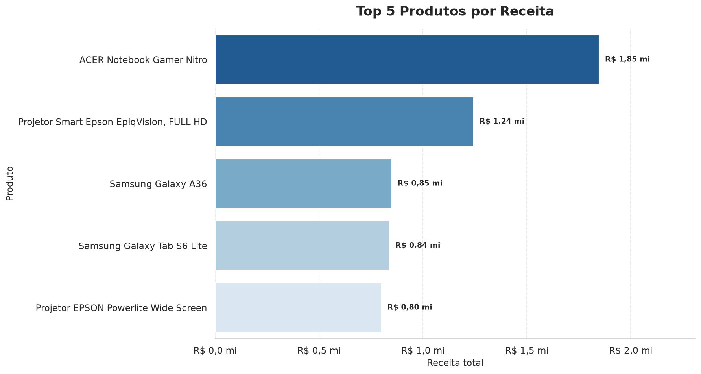
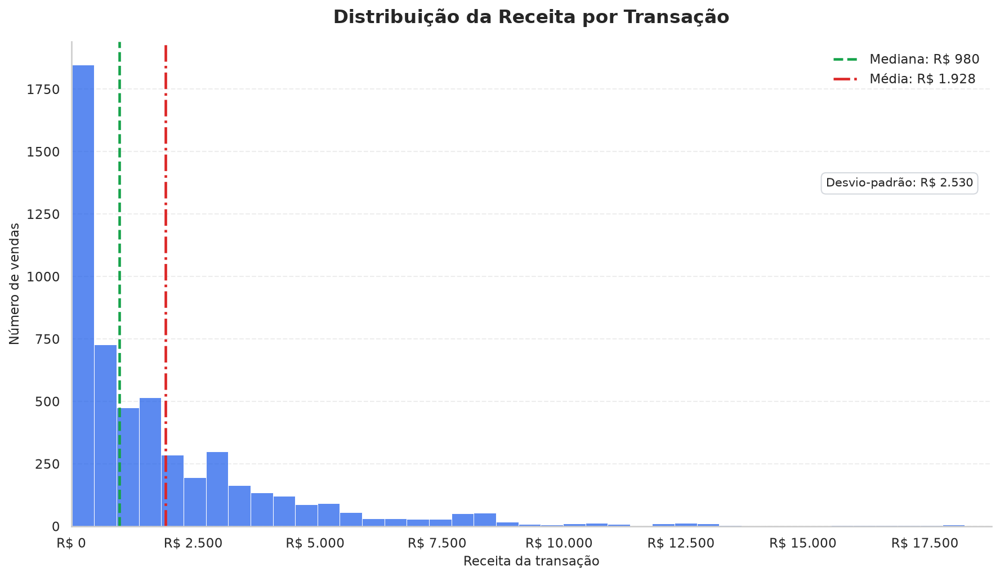
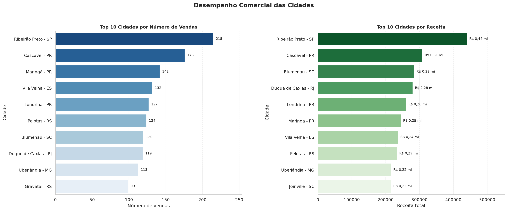

# SalesInsight PY

Análise e visualização de dados de vendas desenvolvida como Mini-Projeto Avaliativo do Módulo 01 do curso **Desenvolvimento de IA para Análise Preditiva — SENAI/SC**.

O projeto organiza um fluxo de análise com Python, Pandas, NumPy, Matplotlib e Seaborn, partindo de dados brutos até a geração de métricas comerciais, segmentação de clientes, visualizações e relatório consolidado em JSON.

## Objetivo

Analisar vendas realizadas entre **1º de janeiro e 30 de junho de 2025**, respondendo às seguintes perguntas:

- Como a receita evoluiu ao longo dos meses?
- Quais produtos e categorias geraram mais receita?
- Quais regiões apresentaram melhor desempenho?
- Quais clientes concentraram os maiores gastos?
- Como os valores das vendas estão distribuídos?
- Quais cidades concentraram mais vendas e receita?

## Dataset

O arquivo `data/raw/vendas.csv` foi construído a partir do [E-commerce Analytics Dataset Brazil](https://www.kaggle.com/datasets/joocarlosjr/e-commerce-analytics-dataset-brazil).

A base foi consolidada, adaptada e enriquecida com informações comerciais e logísticas. Também foram mantidas inconsistências controladas para aplicação das técnicas de limpeza e validação.

| Característica | Valor |
|---|---:|
| Registros brutos | 5.732 |
| Colunas originais | 15 |
| Registros válidos | 5.361 |
| Registros removidos | 371 |
| Colunas após transformação | 24 |
| Clientes únicos | 534 |
| Período analisado | Janeiro a junho de 2025 |

O arquivo bruto permanece preservado e não é sobrescrito durante a execução.

## Etapas da análise

O projeto foi organizado em dois notebooks.

### Notebook principal

O arquivo [`notebooks/sales_insight.ipynb`](notebooks/sales_insight.ipynb) executa:

1. carregamento e inspeção dos dados;
2. validação de identificadores com expressões regulares;
3. limpeza de textos e tratamento de valores ausentes;
4. conversão das colunas de data;
5. validação das variáveis numéricas;
6. criação de variáveis financeiras, temporais e logísticas;
7. cálculo de métricas agregadas com `groupby`;
8. segmentação de clientes com `lambda` e `.apply()`;
9. operações vetorizadas e filtros com NumPy;
10. consolidação e validação do relatório JSON.

### Notebook de visualizações

O arquivo [`notebooks/visualizacoes_vendas.ipynb`](notebooks/visualizacoes_vendas.ipynb) utiliza o dataset processado para gerar e exportar quatro figuras:

- evolução mensal da receita;
- produtos com maior receita;
- distribuição das receitas por transação;
- painel comparativo das cidades com mais vendas e maior receita.

## Principais resultados

| Indicador | Resultado |
|---|---:|
| Vendas analisadas | 5.361 |
| Unidades vendidas | 12.927 |
| Receita total | R$ 10.338.017,17 |
| Ticket médio | R$ 1.928,37 |
| Maior receita mensal | Março — R$ 2.291.715,46 |
| Produto de maior receita | ACER Notebook Gamer Nitro — R$ 1.848.972,94 |
| Categoria de maior receita | Informática — R$ 3.049.354,74 |
| Região de maior receita | Sudeste — R$ 2.829.006,77 |
| Cliente de maior gasto | Ana Luiza Nunes — R$ 116.525,85 |

### Segmentação dos clientes

| Segmento | Clientes | Participação |
|---|---:|---:|
| Ouro | 245 | 45,88% |
| Prata | 182 | 34,08% |
| Bronze | 107 | 20,04% |

### Distribuição das receitas

A receita média por venda foi de **R$ 1.928,37**, enquanto a mediana ficou em **R$ 979,70**. O desvio-padrão populacional foi de **R$ 2.530,21**.

A diferença entre média e mediana mostra que uma quantidade menor de transações de alto valor eleva a média. Das 5.361 vendas analisadas, 1.720 ficaram acima da média, correspondendo a 32,08% das transações.

## Visualizações

### Evolução da receita mensal



### Produtos com maior receita



### Distribuição das receitas



### Desempenho comercial das cidades



O painel de cidades utiliza uma organização **1×2**, comparando as dez cidades com mais vendas e as dez com maior receita. Essa adaptação substitui o painel 2×2 apresentado no documento-base e foi aprovada em aula.

O histograma de receitas substitui o gráfico de dispersão entre quantidade e receita. A mudança prioriza a interpretação da diferença entre média e mediana e da elevada dispersão dos valores das transações.

## Estrutura do repositório

```text
sales-insight-py/
├── data/
│   ├── raw/
│   │   └── vendas.csv
│   └── processed/
│       └── vendas_processado.csv
├── notebooks/
│   ├── sales_insight.ipynb
│   └── visualizacoes_vendas.ipynb
├── reports/
│   ├── figures/
│   │   ├── distribuicao_receitas.png
│   │   ├── receita_por_mes.png
│   │   ├── top_cidades_vendas_receita.png
│   │   └── top_produtos.png
│   └── relatorio_vendas.json
├── src/
│   └── sales_insight/
│       ├── __init__.py
│       ├── apresentacao.py
│       ├── dicionario_dados.py
│       └── visualizacao.py
├── .gitignore
├── pyproject.toml
├── requirements.txt
└── README.md
```

## Requisitos

O projeto aceita as versões de Python definidas em `pyproject.toml`:

```text
Python >=3.12,<3.14
```

Portanto, são suportadas as versões **Python 3.12** e **Python 3.13**.

### Ambiente utilizado no desenvolvimento

| Tecnologia | Versão |
|---|---:|
| Python | 3.13.14 |
| Pandas | 3.0.5 |
| NumPy | 2.5.1 |
| Matplotlib | 3.11.1 |
| Seaborn | 0.13.2 |
| IPython | 9.16.1 |
| Jinja2 | 3.1.6 |

Essas são as versões efetivamente utilizadas e validadas durante o desenvolvimento. As dependências do projeto não estão fixadas a essas versões específicas.

## Instalação

Clone o repositório:

```bash
git clone https://github.com/CorreaBrunoMiguel/sales-insight-py.git
cd sales-insight-py
```

Crie um ambiente virtual:

```bash
python -m venv .venv
```

Ative o ambiente no Linux ou macOS:

```bash
source .venv/bin/activate
```

No Windows PowerShell:

```powershell
.venv\Scripts\Activate.ps1
```

Atualize o `pip` e instale o projeto em modo editável:

```bash
python -m pip install --upgrade pip
python -m pip install -e .
```

A instalação editável disponibiliza o pacote `sales_insight` e instala as dependências declaradas em `pyproject.toml`.

## Execução

Os notebooks devem ser executados nesta ordem:

1. `notebooks/sales_insight.ipynb`;
2. `notebooks/visualizacoes_vendas.ipynb`.

### Visual Studio Code

Abra o repositório no VS Code, instale as extensões **Python** e **Jupyter** e selecione o interpretador do ambiente `.venv` como kernel dos notebooks.

### JupyterLab

Instale o JupyterLab no ambiente:

```bash
python -m pip install jupyterlab
```

Inicie-o a partir da pasta dos notebooks para preservar os caminhos relativos usados pelo projeto:

```bash
cd notebooks
jupyter lab
```

Execute primeiro `sales_insight.ipynb`. Esse notebook gera o dataset processado e o relatório JSON. Depois execute `visualizacoes_vendas.ipynb` para regenerar as quatro figuras PNG.

## Artefatos gerados

| Arquivo | Conteúdo |
|---|---|
| `data/processed/vendas_processado.csv` | Dataset limpo e enriquecido |
| `reports/relatorio_vendas.json` | Indicadores e resultados consolidados |
| `reports/figures/receita_por_mes.png` | Evolução mensal da receita |
| `reports/figures/top_produtos.png` | Cinco produtos com maior receita |
| `reports/figures/distribuicao_receitas.png` | Distribuição das receitas por transação |
| `reports/figures/top_cidades_vendas_receita.png` | Rankings de cidades por vendas e receita |

## Vídeo de demonstração

O vídeo de apresentação será incluído antes da entrega final.

<!-- Substituir pelo link público do vídeo após a publicação. -->

## Autor

**Bruno Miguel Corrêa**

- [GitHub](https://github.com/CorreaBrunoMiguel)